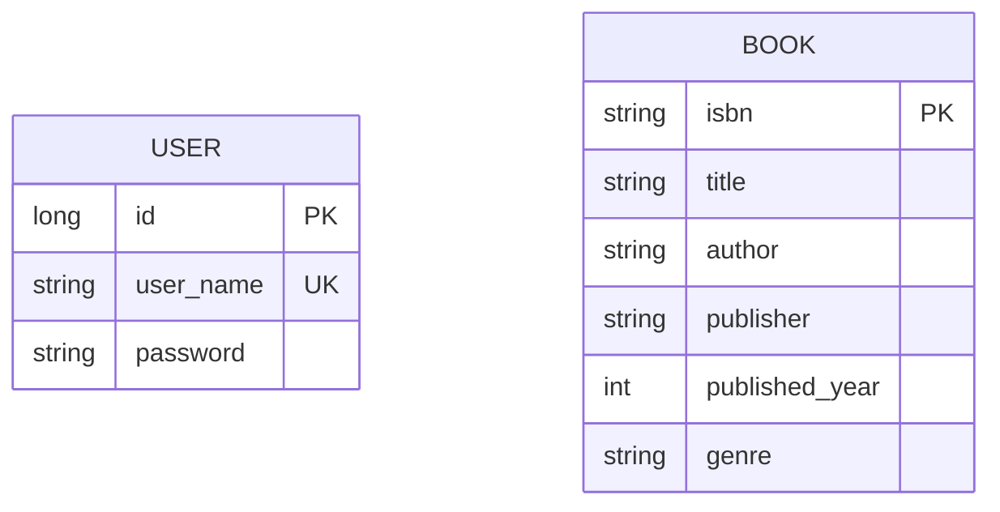

For simplicity and flexibility we going to use H2 database for this project.

## Entity Diagram

UNIQUE(title, author): This constraint ensures that there cannot be multiple entries in the **books** table with the same
title by the same author.

